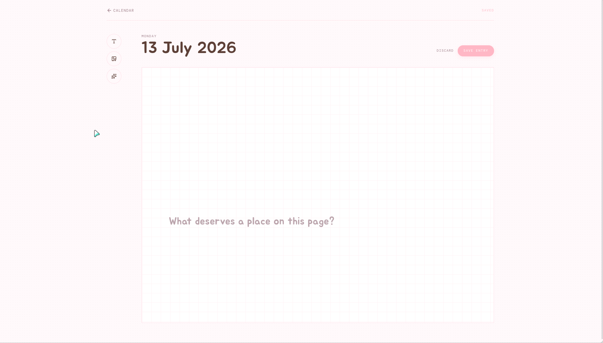
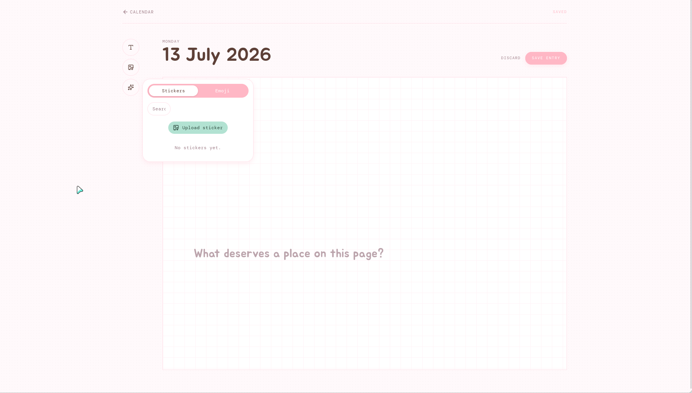
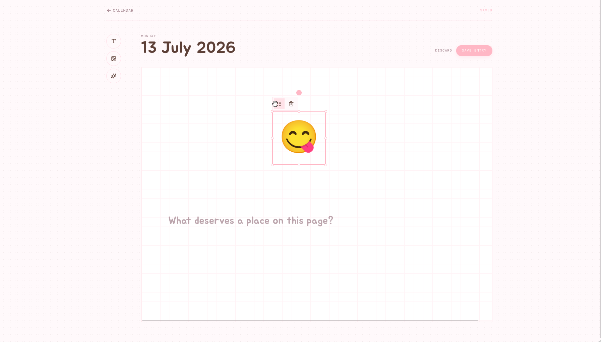

# Dearly

A private diary for composing dated memories on a freeform canvas.

## Screenshots

| Calendar | Canvas |
| --- | --- |
|  |  |

| Image picker | Stickers & emoji |
| --- | --- |
|  |  |

| Emoji picker | Canvas element |
| --- | --- |
|  |  |

## Stack

Cloudflare Workers, D1, R2, Effect, Foldkit, TypeScript, Bun, and Turbo.

## Local development

```bash
bun install
bun run dev
```

```bash
bun run check
bun run test
```
