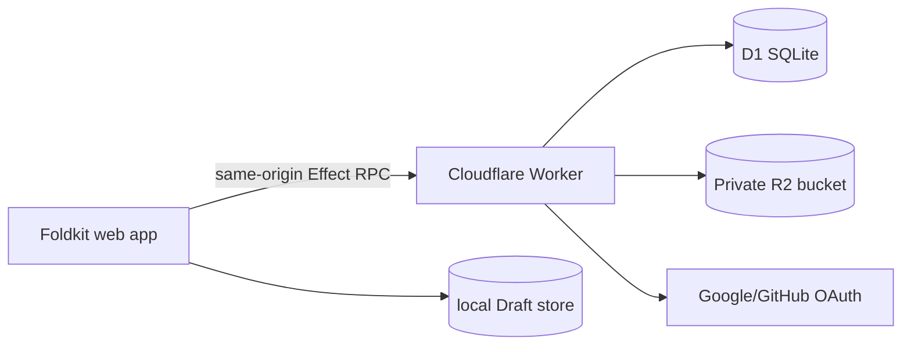

# Dearly Implementation Plan

Dearly is a private, single-owner diary app with a month calendar and one freeform canvas Diary Entry per date.

## Product contract

- Calendar view shows a selected month as Date Cards.
- Date Cards are clickable, including adjacent visible days used for fast month/date switching.
- A Date Card can show an Entry Preview: text snippet, one visual thumbnail, and saved/unsaved state.
- Entry view opens one Diary Entry for one calendar date.
- Entry view has a left circular tool rail for adding text, images, stickers, and selection/move mode.
- Canvas supports positioned, resized, layered Canvas Elements.
- Drafts are local-only and survive browser restarts until explicitly saved or discarded.
- Saved Entries persist to Cloudflare and survive across devices.
- First version is private: one Owner, no sharing.

## Technical decisions already captured

- `docs/context.md` defines domain language only.
- `docs/materials/research.md`: Research Result and Key to implement this
- `docs/adr/0001-consumer-oauth-for-owners.md`: use Google/GitHub-style consumer OAuth, not Cloudflare OAuth for diary users.
- `docs/adr/0002-single-worker-application.md`: serve frontend assets and API from one Worker.
- `docs/adr/0003-cloudflare-d1-for-data.md`: use D1 for Owner, entry, canvas, preview, sticker metadata, and R2 object metadata.
- `docs/adr/0004-private-r2-media.md`: store images/stickers in private R2 and serve through authenticated Worker routes.
- `docs/adr/0005-tiptap-for-rich-text-elements.md`: use TipTap/ProseMirror for rich text Canvas Elements.

## Monorepo shape

```txt
apps/
  web/          # Foldkit app, Vite build, static assets
  worker/       # Cloudflare Worker runtime, RPC, auth, media routes
packages/
  domain/       # Effect Schema domain types, branded IDs, tagged errors
  rpc/          # shared Effect RpcGroup and payload schemas
  ui/           # cute reusable Foldkit UI primitives and theme tokens, if reuse appears
infra/
  alchemy.run.ts
  cloudflare.ts
docs/
  context.md
  adr/
  materials/
```

Keep `packages/ui` small. Start components in `apps/web`; extract only when repeated.

## Runtime architecture



- Browser owns interactive canvas state while editing.
- Worker owns authentication, persistence, media access checks, and RPC handlers.
- D1 stores structured metadata and JSON payloads.
- R2 stores binary image/sticker objects only.
- Static assets ship with the Worker to avoid a second deployment surface.

## Effect / RPC contract

- Define schemas and tagged errors in `packages/domain`.
- Define a shared `RpcGroup` in `packages/rpc`.
- Use schema-backed errors such as `Unauthorized`, `EntryNotFound`, `MediaTooLarge`, `DraftConflict`.
- Keep request handlers mostly I/O. Free Worker CPU is tight; avoid image processing in Worker.
- Construct RPC server wiring at Worker initialization; perform request-specific work inside handlers.

Initial RPC procedures:

- `getSession`
- `listMonthEntries`
- `getEntryByDate`
- `saveEntry`
- `discardServerEntry` only if destructive server deletion is in scope
- `createMediaUpload`
- `getMediaObject`
- `listStickers`
- `createSticker`
- `deleteStickerFromPicker`

## Data model

D1 tables, first pass:

- `owners`: internal Owner row keyed by verified email identity merge policy.
- `oauth_identities`: provider identity rows linked to Owner.
- `sessions`: same-origin session cookies.
- `diary_entries`: one row per Owner/date, stores saved Canvas state JSON and preview fields.
- `media_objects`: R2 key, media kind, MIME, size, owner, lifecycle state.
- `stickers`: reusable picker items backed by `media_objects`.

Constraints:

- Unique `(owner_id, entry_date)` for `diary_entries`.
- Unique provider identity `(provider, provider_subject)`.
- Index month lookup by `(owner_id, entry_date)`.
- Do not store binary media in D1.

## Draft and save model

Recommended first-version flow:

1. User edits Diary Entry in local Draft state.
2. Newly added images become Staged Media: local file/blob references plus local element references.
3. On Save, upload staged media to private R2 through Worker-controlled upload routes.
4. Worker records uploaded media metadata in D1.
5. Worker saves the Diary Entry JSON with final media references.
6. Browser marks Draft clean only after Worker confirms the saved entry.
7. If Save fails, keep Draft and Staged Media locally.

This prioritizes no lost local work over perfect orphan cleanup. Orphaned R2 objects can be cleaned later by lifecycle job/manual maintenance if needed.

## UI direction

- Cute scrapbook, not generic dashboard.
- Use the supplied TweakCN palette as source of theme tokens.
- Large playful Date Cards, soft rounded geometry, tactile controls.
- Canvas should feel like a desk/scrapbook surface, not a document editor.
- Tool rail uses circular buttons with clear active/disabled states.
- Dirty Draft state must be always visible in Entry view.
- Use motion sparingly: date open/close, tool insertion, save confirmation.

Initial Foldkit model:

- `route`: calendar or entry date.
- `calendar`: selected month, selected date.
- `entriesByDate`: preview cache for visible month.
- `drafts`: local dirty canvas states keyed by date.
- `canvas`: selected element, drag/resize state, layer ordering.
- `media`: staged files, sticker picker state, upload progress.
- `session`: Owner auth state.

## Cloudflare free-tier guardrails

- Worker Free: 100,000 requests/day, 10 ms CPU limit, 128 MB memory, 50 subrequests/request, 6 outgoing connections/request, 3 MB Worker size.
- Static asset individual limit: 25 MiB.
- D1 Free: 10 DBs/account, 500 MB max DB size, 5 GB storage/account, 50 queries/invocation, 2 MB max row/string/BLOB.
- R2 platform object limits are high, but pricing/free allowance still must be checked before production use.
- Avoid public `r2.dev`; serve private media through authenticated routes.

## Turbo tasks

- `build`: compile domain/rpc before web/worker.
- `check`: TypeScript/package validation.
- `test`: focused Foldkit Story/Scene tests and Worker handler tests.
- `dev`: local Worker dev serving web assets.
- `deploy`: Alchemy Cloudflare deployment.

## Implementation phases

1. Scaffold monorepo with TurboRepo, TypeScript, package manager, and shared config.
2. Add `packages/domain` with branded IDs, schemas, and tagged errors.
3. Add `packages/rpc` with initial `RpcGroup` and client/server exports.
4. Add `apps/worker` with Worker entrypoint, Effect RPC handler, session cookie plumbing, D1/R2 bindings, and static asset serving.
5. Add `infra` Alchemy resources for Worker, D1, R2, secrets, and static assets.
6. Add `apps/web` Foldkit app shell with routes, month calendar, entry canvas, and theme tokens.
7. Implement consumer OAuth login and Owner identity merge by verified email.
8. Implement month preview queries and Date Card states.
9. Implement local Draft persistence.
10. Implement Canvas Element create/select/move/resize/layer behavior.
11. Integrate TipTap for text Canvas Elements.
12. Implement media staging, save upload flow, private media routes, and sticker picker.
13. Add focused behavioral tests for RPC handlers, auth ownership checks, draft save failure preservation, and core Foldkit update transitions.
14. Deploy with Alchemy to Cloudflare.

## Open risks

- Foldkit and `effect-smol` are young. Pin versions and prove a tiny RPC + Foldkit skeleton before building broad features.
- Worker Free CPU can be exceeded by heavy server transforms. Keep media processing client-side or defer it.
- D1 row size makes full canvas JSON acceptable only while entries stay modest. Watch growth early.
- Save ordering can create orphaned R2 objects. First version should preserve user work; cleanup can follow after real usage proves need.

## Unresolved questions

1. OAuth providers: start with Google only, GitHub only, or both? Google first, GitHub second after auth abstraction works.
2. Draft persistence backend: IndexedDB or localStorage? IndexedDB because Staged Media needs Blob/File storage.
3. Canvas size: fixed logical page or infinite board? fixed logical page first; zoom/pan later.
4. Image handling: preserve originals or create thumbnails? preserve originals in R2 and generate client-side preview thumbnails stored separately.
5. Sticker library: built-in starter stickers or user-uploaded only? user-uploaded only for first version to avoid asset licensing and moderation.
